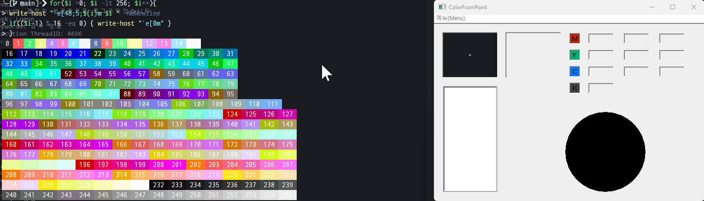

# 📌 ColorFromPoint 
Windows Legacy API와 후킹을 이용한 컬러 피커입니다. 
이 프로젝트는 MIT 라이선스 하에 제공되어 누구나 자유롭게 사용, 수정, 배포할 수 있습니다. 개인 또는 상업적 용도로도 활용이 가능합니다. 
  
## 📝 Description 
"ColorFromPoint"는 이름 그대로 마우스 커서가 위치한 지점의 색상을 조사하는 프로그램입니다. 
에디트 컨트롤을 이용하여 CMYK, RGB, HEX 값을 표기하며 알파 채널은 지원하지 않습니다. 
  
## 🚀 Getting Started 
### 🔧 Dependencies 
Windows 10 이상 
MyApiDll.dll 
 
### 📥 Installing 
[Releases](https://github.com/stdFrog/ColorFromPoint/releases) 페이지에서 최신 버전을 확인하실 수 있습니다. 
압축 해제 후 `ColorFromPoint.exe` 또는 `ColorFromPointInstaller.exe`를 실행합니다. 
설치 파일(ColorFromPointInstaller.exe)을 다운로드한 경우 안내에 따라 안전하게 실행 파일(ColorFromPoint.exe)을 설치하시면 됩니다. 
 
### ▶️ Executing program 
- ColorFromPoint.exe 
  
## ❓ Help 
- 일반적으로 웹에서 사용되는 색상 공간은 알파 채널을 포함하며 웹 개발자에 의해 설정된 알파값으로 인하여 렌더링된 색상이 서로 달라보일 수 있습니다. 
- 위 프로그램이 조사하는 색상은 대체로 sRGB 색상 값입니다. Windows 환경에서는 일반적으로 sRGB 색 공간이 사용되므로 이를 조사하며, 대부분의 디스플레이나 프린터에서도 sRGB를 표준으로 선택합니다. 
- 조작 방법은 프로그램 실행 후 [메뉴] - [프로그램 소개] 항목에서 확인하실 수 있습니다. 
  
## 👤 Authors 
- stdsic — @https://github.com/stdsic/ColorFromPoint 
  
## 📚 Version History 
- 1.0.0 
  - 최초 릴리스 
  
## 🧾 License 
이 프로젝트는 [MIT License](LICENSE)로 라이선스되어 있습니다. 
자세한 정보는 LICENSE 파일을 참고하시기 바랍니다. 
 
